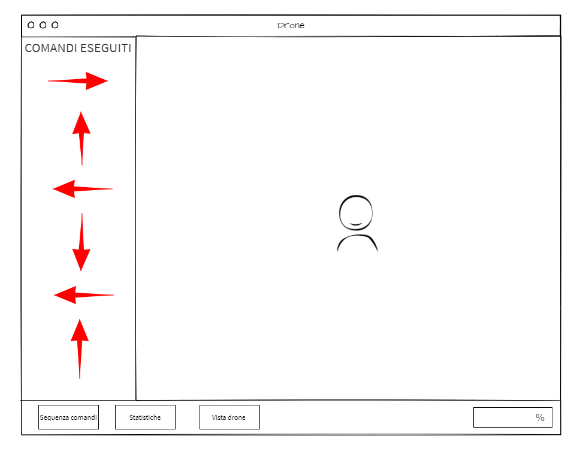
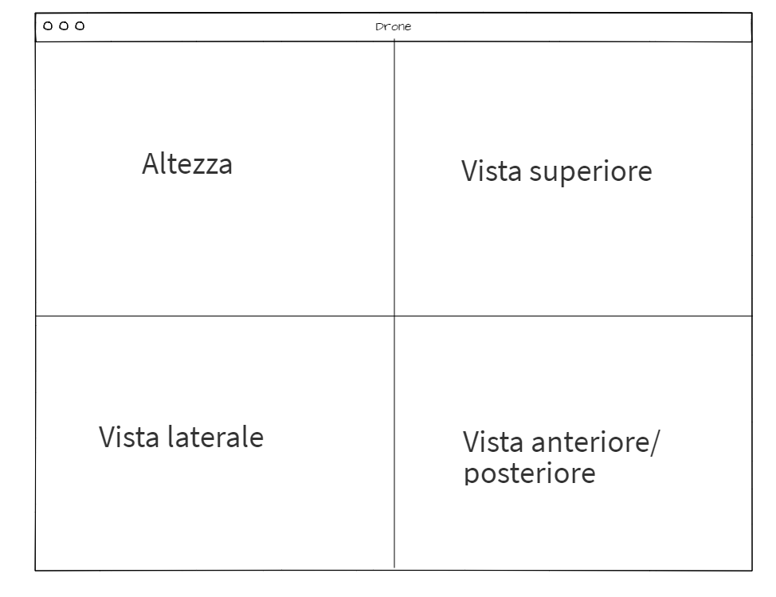

# Drone | Diario di lavoro
##### Michea Colautti, Alessandro Aloise, Gianni Grasso, Samuele Ganci
### Centro Professionale Trevano, 21.01.2021

## Lavori svolti

|Orario        |Lavoro svolto                                       |Eseguito da         |
|--------------|----------------------------------------------------|--------------------|
|10:05 - 11:00 | Presentazioni membri gruppo rimanenti              |Tutti               |
|11:00 - 11:15 | Riassunto scorsa giornata e riunione iniziale      |Tutti               |
|11:15 - 11:30 | Sviluppo interfacce applicativo                    |Alessandro e Gianni |
|11:15 - 11:30 | Diagramma di Gantt                                 |Michea e Samuele    |
|12:20 - 14:00 | Sviluppo interfacce applicativo                    |Alessandro e Gianni |
|12:20 - 14:00 | Sviluppo diagramma di Gantt                        |Michea e Samuele    |
|14:15 - 14:30 | Revisione interfacce applicativo                   |Alessandro e Michea |
|14:15 - 14:30 | Revisione digramma di Gantt                        |Gianni e Samuele    |
|14:30 - 15:05 | Scrittura diario                                   |Michea e Alessandro |
|14:30 - 15:45 | Ricerca funzionamento comandi drone                |Gianni              |
|14:30 - 15:45 | Assegnazione risorse Gantt                         |Samuele             |
|15:05 - 15:20 | Revisione tempistiche Gantt                        |Alessandro          |
|15:05 - 15:30 | Scrittura problemi dopo consultazione con compagni |Michea              |
|15:20 - 15:45 | Assistenza nella ricerca del sistema di Guida      |Alessandro          |
|15:20 - 15:45 | Assistenza nelle parti finali del Gantt            |Alessandro          |

## Problemi riscontrati e soluzioni adottate

1.	Sviluppando l'interfaccia garfica non siamo inzialmente riusciti a visionare in maniera efficace tutti gli elementi. Per esmepio non risucivano a figuare come impostare la pagina in cui inserie tutti i dati e le differenti "maschere" richieste. Tuttavia siamo partiti dalle basi della `view`, come per esempio la finestra principale con la live, per poi arrivare a disporre i pulsanti per l'apparizione delle maschere.
 
2.	Per quanto riguarda la creazione del diagramma di Gantt, abbiamo torvato difficile calcolare i tempi necessari per tutte le sotto-attività che abbiamo definito. Quindi siamo partiti dai requisiti che avevamo già finito, tentando di assegnare un attività che potesse comprenderne almeno uno. Fatto questo abbiamo, dopo una breve consultazione con gli altri membri, deifinto dei tempi.

3. Quando le due coppie (Michea-Samuele e Alessandro-Ganci), hanno finito il loro compito principale alle 14:00, ci siamo acccorti che alcune tempistche erano da aggiutare. Per questo abbiamo, dopo una revisone del lavoro altrui, deciso di rivedere le tempistche del Gantt, Alessandro se ne è occupato in maniere propenderante poichè aveva più esperienza di noi nella gestione di un progetto.
 
4. Mentre Alessandro definiva dei tempi appropiati, Gianni si è occupato di iniziare delle ricerche su come viene controllato il dorne. Infatti nella nostra testa non avrebbe avuto senso inizare a sviluppare un qualcunque algoritmo o definire un diagramma di flusso sennza avere una nozione di base sulla guida del drone.

5. Sia Samuele che Gianni erano impegnati in ricerche e revisioni fino alla fine della lezione, perciò Alessandro si è occupato di fornire assistenza ad entrambi, alternandosi sia per dare consigli che per consultarsi per decidere la soluzione migliore.

6. Online non sono presenti istruzioni chiarissime per quanto riguarda il drone, pensavamo magari che la ricerca sul sistema di guida fosse veloce ma non abbbiamo trovato molti documenti che dpeigassero e illsutrassero le specifiche del drone, per questo abbiamo impegato molto tempo, ma non pensiamo sia vano.

7. Dopo aver assegnato le risorse, abbiamo docuto rivedre leggermente le tempisitiche, magari per alcuni compiti abbiamo previsto un membro, mentre per altri 2 o addirittura 3/4.

Ecco quindi le soluzioni riassunte:

> 1.	Iniziare dagli elementi alla base della GUI e procedere passo-passo. Alleghaimo i due design.
> 
> 
> 2.	Consultazione tabella requisiti e stima dei tempi secondo le esperienze passate.
> 3.	Abbiamo rivisto le tempistiche del Gantt, facendo delle nuove stime.
> 4. 	Ricerca focalizzata sulla guida del drone.
> 5. 	Ricerca sia su documenti online che su progetti simili svolti in precedenza.
> 6.	Addattamento tempisitche attività in base alle risorse.

##  Punto della situazione rispetto alla pianificazione
Benchè la pianificazione non sia del tutto conclusa, non siamo arrivati fino a dove volevamo arrivare. Infatti delle difficoltà nello sviluppo del diagramma Gantt no ce lo hanno permesso.
## Programma di massima per la prossima giornata di lavoro
Volgiamo fare il diagramma di flusso, e arrivare a poter contrllare il drone da una semplice GUI, con magari quattro frecce direzionali. O almeno a instaurare una comunicazione tra drone e pc.
