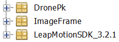
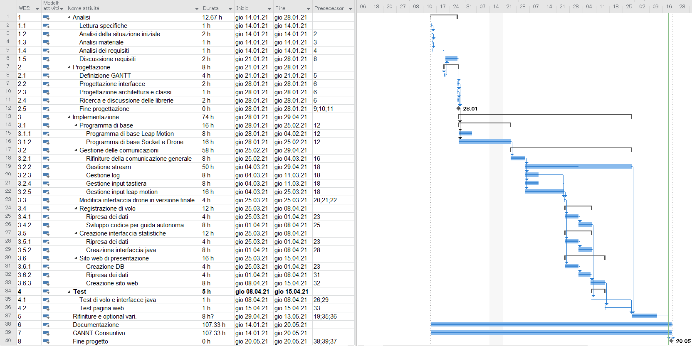

1. [Introduzione](#introduzione)
  - [Informazioni sul progetto](#informazioni-sul-progetto)
  - [Abstract](#abstract)
  - [Scopo](#scopo)

2. [Analisi](#analisi)
  - [Analisi del dominio](#analisi-del-dominio)
  - [Analisi e specifica dei requisiti](#analisi-e-specifica-dei-requisiti)
  - [Use case](#use-case)
  - [Pianificazione](#pianificazione)
  - [Analisi dei mezzi](#analisi-dei-mezzi)

3. [Progettazione](#progettazione)
  - [Design delle interfacce](#design-delle-interfacce)
  	- [Interfaccia principale](#interfaccia-principale)
	- [Interfaccia vista drone](#interfaccia-vista-drone)
  - [Design procedurale](#design-procedurale)
  - [Design di architettura del sistema](#design-di-architettura-del-sistema)

4. [Implementazione](#implementazione)

5. [Test](#test)
  - [Protocollo di test](#protocollo-di-test)
  - [Risultati test](#risultati-test)
  - [Mancanze e limitazioni conosciute](#mancanze-e-limitazioni-conosciute)

6. [Consuntivo](#consuntivo)

7. [Conclusioni](#conclusioni)

  - [Sviluppi futuri](#sviluppi-futuri)
  - [Considerazioni personali](#considerazioni-personali)

8. [Sitografia](#sitografia)

9. [Allegati](#allegati)


## Introduzione
### Informazioni sul progetto
- Allievi coinvolti nel progetto:  Gianni Grasso, Samuele Ganci, Alessandro Aloise, Michea Colautti.
- Classe: I3AA, I3AC, Scuola Arti e Mestieri Trevano, sezione Informatica.
- Docenti responsabili: Luca Muggiasca, Geo Petrini.
- Data inizio: 14 gennaio 2021.
- Data di fine: 13 maggio 2021.

### Abstract

  > *Nowadays, technology around us is costantly evolving, even becoming vital. Thanks
  to computer system, the way we entertain ourselves has changed in recent times,
  technology enternains us. Recently, aumented reality devices such as VR devices,
  hands and arms sensors, and more. These things have become increasingly common in the
  market. In this project we managed to implement piloting a drone with our hands, thanks
  to the help of a device called Leap Motion. With little money now you can buy
  a Leap Motion and a Drone to be able to enjoy driving the DJI Tello using only
  your hands in a very intuitive and simple way.*

### Scopo

  Lo scopo del progetto è di creare un software in grado di collegare i movimenti delle nostre mani ad un drone.
  In pratica, grazie a un sensore chiamato `Leap Motion`, la nostra applicazione deve essere in grado di catturare e analizzare i movimenti
  delle mani e, dopo averli processati, trasmetterli al drone. Per farlo dobbiamo usare la tecnologia `UDP` (**U**ser **D**atagram **P**rotocol) e
  l'`SDK` installata di fabbrica sul drone.
  Dobbiamo, oltre a creare il sistema di pilotaggio, instaurare una comunicazione che permetta lo scambio di dati del drone; non solo dati come l'inclinazione,       l'altitudine, ma anche dati statistici come la batteria.

## Analisi

### Analisi del dominio

  È stato richiesto di creare un'interfaccia di controllo utile a pilotare un drone DJI Tello, il
  movimento del velivolo deve avvenire tramite lo spostamento di entrambe le mani, inoltre, deve
  essere visualizzato a schermo il video del drone in streaming. Una mano si occupa di imbardata,
  beccheggio e rollio, l'altra invece dell'altitudine. Deve inoltre essere possibile registrare una
  sequenza di comandi per poi poterla far riprodurre dal drone successivamente in modo autonomo.

  Deve essere inoltre creata un'ulteriore interfaccia che deve avere 4 riquadri, che rappresenteranno
  in 2D in forma stilizzata rispettivamente l'imbardata, il beccheggio, il rollio e l'altitudine del drone.

  Le interfacce perciò si devono occupare dei dati ricevuti dal drone, e successivamente
  fare in modo di renderli reperibili in una pagina web sotto forma di statistica.

  Il tutto deve essere programmato in Java.

### Analisi e specifica dei requisiti


|               |**ID: Req-001**|
|--------------|-----------------------------|
|**Nome**      | Utilizzo di DatagramPacket   |
|**Priorità**  | 1                           |
|**Versione**  | 1.1                         |
|**Note**      | La connessione al drone deve avvenire tramite  UDP|


|               |**ID: Req-002**|
|--------------|-----------------------------|
|**Nome**      | Interfaccia controllo Drone |
|**Priorità**  | 3                            |
|**Versione**  | 1.1                         |
|**Note**      | Panel o frame diviso in 4 con delle imagini 2d del drone per vedere come si muove.|

|               |**ID: Req-003**|
|--------------|-----------------------------|
|**Nome**      | Gestione tastiera *Extra* |
|**Priorità**  | 2                           |
|**Versione**  | 1.1                         |
|**Note**      | Comandare il drone con la tastiera.|


|               |**ID: Req-004**|
|--------------|-----------------------------|
|**Nome**      | Leap Motion |
|**Priorità**  | 2                           |
|**Versione**  | 1.1                         |
|**Note**      | Implementare il pilotaggio con il Leap Motion, la mano sinistra si occupa del movimento verticale, mentre la destra si occupa di tutti gli altri movimenti.|


|       |**ID: Req-005**|
|-------|-----------|
|**Nome**| Live video |
|**Priorità**|1|
|**Versione**|1.0|
|**Note**|Realizzare il frame con lo streaming del video del drone.|


|       |**ID: Req-006**|
|-------|-----------|
|**Nome**| Sequenza di comandi |
|**Priorità**|1|
|**Versione**|1.0|
|**Note**|Implementare la funzione di salvataggio di sequenze di comandi. Successivamente fare in modo di farle riprodurre dal drone in modo autonomo.|  

|       |**ID: Req-007**|
|-------|-----------|
|**Nome**| Tasto di emergenza |
|**Priorità**|2|
|**Versione**|1.0|
|**Note**|È stato deciso che ci deve essere un tasto per le emergenze.|

|       |**ID: Req-008**|
|-------|-----------|
|**Nome**| Bottoni per scelta di pilotaggio *Extra* |
|**Priorità**|4|
|**Versione**|1.0|
|**Note**|Necessità di poter scegliere cosa usare se la tastiera o il Leap Motion.|


### Use case

Ecco il nostro Use Case

> Use Case

### Pianificazione

Per la pianificazione alleghiamo il Gantt preventivo da noi stabilito:

> Gantt preventivo


### Analisi dei mezzi

 **Software**
 - Java JDK 14.0.2
 - Leap Motion SDK 3.2.1
 - Tello SDK 2.0
 - Apache Netbeans IDE 12.0

 **Hardware**
- Laptop personali
- PC scolastici
- Drone DJI Tello
- Leap Motion


## Progettazione

### Design delle interfacce

#### Interfaccia principale
La prima interfaccia che abbiamo definito è stata quella generale, ovvero il pannello che l'utente avrebbe visto una volta avviata l'applicazione.

> Interfaccia drone

Come vedremo dopo, benché la struttura sia rimasta essenzialmente quella, quest'interfaccia ha subito alcune modifiche nel contenuto.
Questo è accaduto poiché procedendo con il progetto sono cambiate alcune idee e priorità.


#### Interfaccia vista drone

Un’altra interfaccia importante da progettare era quella della vista del drone. Quest'ultima è molto semplice, ed è rimasta essenzialmente la stessa, ma è stato importante pensare come rappresentare i dati che ci venivano richiesti, ovvero la rappresentazione grafica del drone. Inizialmente abbiamo pensato a delle foto ferme, con delle frecce che indicassero i movimenti. Tuttavia ci siamo accorti che creare uno schizzo del drone e muovere quello era molto più.


> Interfaccia della posizione del drone

### Design procedurale


Dopo aver progettato le due interfacce principali abbiamo pensato di creare uno schema di flusso dell'applicazione.
Sapevamo più o meno come procedere e come impostare il nostro progetto, ma abbiamo comunque voluto mettere le nostre idee su "carta".


> Funzionamento programma

In quest'immagine s si può vedere la struttura schematizzata della nostra applicazione.

1. Il Leap Motion, tramite la sua Liberia dedicata, passa i dati al computer e il nostro programma li legge, e li interpreta.
2. Dopo avere ottenuto i dati grezzi, il programma gli elabora, converte dati come l'inclinazione della mano o la velocità della stessa, in istruzioni che il drone può interpretare.
3. Come terzo passaggio i dati vengono inviati tramite socket al drone, un socket UDP.
4. Una volta inviati i droni vengono elaborati dall'SDK presente sul chip nel drone.
5. Quando e mentre i dati vengono elaborati dal drone, esso risponde con dei messaggi di conferma. Ma non solo. Infatti il drone invia anche dati sulla sua batteria, sulla sua posizione [x,y,z], ma anche dati sulla sua inclinazione. Questi dati vengono interpretatati dal nostro programma e elaborati. Questo ci permette, per esempio, di far funzionare la rappresentazione grafica del drone.

### Design di architettura del sistema

Per il nostro progetto abbiamo deciso di procedere in maniera modulare. Infatti il progetto finale è una combinazione di più modifiche e test messi insieme. Abbiamo iniziato da una base semplice e dunque solida, per poi implementare man man ogni funzionalità al programma di base.
Abbiamo cominciato testando in modo parallelo il funzionamento del leap motion e del drone separatamente.


> Progetti di base

Successivamente ad aver compreso il funzionamento di entrambi gli apparecchi abbiamo collassato il tutto in un solo progetto, nel progetto `drone`. All'interno di queso abbiamo pensato di creare 3 package, uno con tutti i file SDK per lavorare con il Leap Motion, uno contenente le classi che lavorano con le immagini per rappresentare la posizione del drone, ed infine un altro ancora per il pilotaggio del drone. Il risultato finale è come di seguito.


> Divisione del progetto in packages


## Implementazione

Per lo sviluppo di questo progetto il lavoro è stato suddiviso in tre principali sezioni, lo sviluppo delle classi relative al drone, ovvero la parte che concerne la comunicazione tra drone e utente, l'interfaccia principale e le diverse funzioni implementate, lo sviluppo delle classi relative al Leap Motion, ovvero la parte logica per quello che concerne la comunicazione tra drone e Leap Motion, la calibrazione dei comandi e la sensibilità dei movimenti del drone, e infine lo sviluppo delle classi  dell'Image Frame, ovvero la parte relativa alle varie interfacce contenenti le statistiche del drone e le rappresentazioni grafiche dei movimenti.

Per la sezione di progetto dedicata al drone sono state realizzate le seguenti classi:
1. Drone
2. DroneFrane
3. ComandiPanel
4. FunzioniPanel
5. Status
6. Log
7. Browser

### DronePK

Il funzionamento della comunicazione tra drone e utenti è piuttosto semplice, il drone possiede un proprio wi-fi e di conseguenza ha un suo ip e diverse porte sulla quale connettersi, alcune delle quali servono per la ricezione e l'invio di informazioni. È stata creata un'interfaccia principale grazie alla quale l'utente può interagire e usare tutte le funzionalità che offre il software. L'interfaccia principale è suddivisa in diverse sezioni, una sezione laterale per i comandi eseguiti, una barra in basso per eseguire alcune funzioni e visualizzare alcune statistiche come batteria e velocità, infine la parte principale al centro in cui si vedono tutti i dati relativi alla posizione e ai movimenti del drone.
Per prima cosa è stata realizzata la comunicazione tra leap motion e drone, quindi la parte relativa al pannello centrale, per poter instaurare una comunicazione tra leap motion e drone è stato creato un socket grazie alla quale l'utente client invia dei pacchetti su una determinata porta del drone, questi pacchetti sono delle semplici stringhe contenenti dei comandi che vengono interpretate dal drone tramite un suo protocollo interno. Quello che succede quindi, è che il leap motion continua a passare i dati che legge al drone, spedendoli in tempo reale tramite il socket, il drone riceve quindi questi pacchetti e si muove di conseguenza.

#### Drone
Questa classe é una delle parti fondamentali del progetto, infatti tutta la comunicazione parte da qui. La creazione del Socket è in questa classe, più moltissime altre cose che ora andremo a vedere.

Come prima parte di codice che andiamo a vedere è il costruttore che troviamo qui sotto:

```java
public Drone() {
	try {
		socket = new DatagramSocket();
	} catch (SocketException ex) {
		System.out.println("ERRORE: " + ex.getMessage());
	}
	port = socket.getLocalPort();
    status.start();
    setUp();
}
```
Questo costruttore racchiude la crazione del `DatagramSocket` e l'assegnazione della porta, inoltre nella parte sottostante del costruttore troviamo anche l'avvio di una Thread e un metdo che si chiama `setUp()` che si occupa di impostare i valori di base.

Passando invece al metodo `public void run()` questo metodo si occupa della reciezzione del pacchetto dal drone.

```java
public void run() {
	try {
		while (true) {
			DatagramPacket packet = new DatagramPacket(sendBuf, sendBuf.length);
			socket.receive(packet);
			messageReceived = new String(packet.getData(), 0, packet.getLength());
			System.out.println(messageReceived);
		}
	} catch (SocketException ex) {
		System.out.println("ERRORE: " + ex.getMessage());
	} catch (IOException ex) {
		System.out.println("ERRORE: " + ex.getMessage());
	}
}
```

Questo metodo rimane in attesa che il drone gli mandi un pacchetto, quando lo ha ricevuto lo stampa sulla console. L'atto di stampare è servito più a noi come debug per vedere se tutto andava bene.

Per quanto riguarda la spedizione dei pacchetti al drone abbiamo usato il seguente metodo:

```java
public void sendMessage() {
    try {
        byte[] data = messageToSend.getBytes();
        DatagramPacket packet = new DatagramPacket(data, data.length, destinationIp, destinationPort);
        socket.send(packet);
    } catch (SocketException ex) {
        System.out.println("ERRORE: " + ex.getMessage());
    } catch (IOException ex) {
        System.out.println("ERRORE: " + ex.getMessage());
    }
}
```

Questo metodo come prima cosa crea un array di byte e ci inserisce il messagio da mandare, in secondo luogo impacchetta il messagio all'interno di un  DatagramPacket e dopo lo manda.

Abbiamo deciso di creare un metodo a qui gli si passa una stinga e lui in automatico fa tutti i passaggi per spedirlo e aggiorna tutto ciò che c'é da aggiornare che é il seguente :

```java
public void invioMessaggio(String message) {
        setInfo(ipDrone, porta, message);
        istru = message;
        sendMessage();
        comandiPanel.refreshCommands(message + "\n");
}
```
Questo metodo imposta vari parametri come: ip del drone, la porta e il messaggio. IN seguti, pittosto semplicemente, lo spedisce usando altri metodoti che abbiamo creato, oltre a questo aggiorna anche tutto ciò che è inerente a questo messaggio.


Abbiamo anche crato dei metodi appoiti per decollare, atterrare e per mandare il command il messaggio che serve a "sbloccare " l'SKD dentro il drone, ne vediamo uno dato che tutti gli altri saranno uguali.

```java
public void decolla() {
    String message = "takeoff";
    invioMessaggio(message);
    setStato();
}
```
Come stavamo dicendo, questo metodo in base al comando scritto manda il messaggio e cambia lo stato del drone in modo tale che se il drone è già decollato, non si può mandare più volte lo stesso comando per non rischiare di causare problemi al drone.

#### DroneFrame

`DroneFrame` è una classe fondamentale, si tratta infatti del frame principale dell’applicazione. In esso sono contenuti tutti i due pannelli del package `DronePk`.
1.	`ComandiPanel`
2.	`FunzioniPanel`
Nel frame è inoltre contenuto il frame del package `ImageFrame`, `ImageFrame` appunto.

In riferimento a `ImageFrame` riteniamo opportuno riportate il costruttore del frame principale, in quanto al suo interno ci sono istruzioni molto interessanti:
Oltre a tutti i metodi per aggiungere le interfacce che citeremo qui sotto, c’è l’importante creazione della Thread di `ImageFrame` che, come specificheremo in seguito, viene eseguita qui per un semplice motivo, la rappresentazione del drone deve avvenire fin dal primo momento di vita dell’applicazione.

```java
public DroneFrame() {
	initComponents();
	this.addMouseListener(this);
	this.setMinimumSize(new Dimension(800, 400));
	getContentPane().addComponentListener(this);
	Thread imgView = new Thread(imageFrame);
	imgView.start();
	switchKeyListenerOn();
	setReferences();
}
```

`DroneFrame` estende, come il nome suggerisce, `JFrame` ed implementa 3 interfacce:
1.	`KeyListener`
2.	`MouseListener`
3.	`ComponentListene`

Questo frame avrebbe potuto essere molto semplice, tuttavia abbiamo voluto aggiungere la possibilità di guidare il drone da tastiera. Questo ha portato ad una serie di complicazioni. Infatti per catturare i comandi da tastiera si necessita, chiaramente, di `KeyListener`. Per questo abbiamo i metodi qui, in modo possiamo poi inviare un segnale al pannello apposito, che si occuperà della gestione dei movimenti. Come esempio riportiamo il metodo KeyTyped:

```java
public void keyTyped(KeyEvent e) {
	comandiPanel.keyTypedC(e);
}
```

Tuttavia il progetto prevedeva che il drone si potesse guidare principalmente da `Leap Motion`
Perciò, per ragioni di sicurezza, abbiamo dovuto implementare un modo di catturare i tasti sempre. Questo però andava in contrasto con una nostra altra scelta: se il drone era in uso tramite `Leap Motion`, gli input da tastiera erano da ignorare, in quanto potevano causare problemi che, in alcuni nostri test, hanno portato il drone a schiantarsi.

La classe ComandiPanel è un pannello contenente una Text Area centrale e due Radio Button nella parte inferiore, uno che per abilitare i controlli da tastiera e uno per i controlli da Leap Motion. La parte sottostante del pannello infatti servirà per fare selezionare all'utente quale modalità di pilotaggio adoperare mentre la parte principale composta dal campo di testo ha lo scopo di stampare le sequenze di comandi salvate in precedenza dall'utente, in pratica vengono stampati in ordine cronologico i comandi di tutti i movimeni eseguiti dal drone nella sequenza salvata. Inoltre questa classe contiene anche il key listener, che permette di muovere il drone con l'utilizzo della tastiera.


A questo scopo abbiamo dovuto creare un `emergencyListener`, che abbiamo documentato con precisione nell'implementazione riguardante il `Leap Motion`.

Per quanto riguarda l'impedire che un metodo di input ne sovrascriva un altro, abbiamo implementato una serie di metodi `switch`. Questi metodi vengono richiamata quando si vuole passare da un metodo di guida a un altro. Si puô inoltre accendere o spegnere lo switch per l'emergency o per i comandi da tastiera.


Un altro aspetto abbastanza importante di questa classe è l’implementazione di `ComponentListener`. Questa interfaccia ci serve infatti per monitorare il Frame stesso. Noi abbiamo dovuto limitare la dimensione della finestra, specialmente per le immagini del drone, e per questo abbiamo dovuto porre un controllo sulla dimensione del Frame. Non volendo mettere la finestra bloccata, abbiamo optato per questa soluzione:

il metodo `componentResized()` viene invocato ogni volta che il frame viene ridimensionata, al suo interno abbiamo messo queste istruzioni:

```java
public void componentResized(ComponentEvent e) {
	if (getWidth() < 800) {
		this.setSize(800, getHeight());
	}
	if (getHeight() < 500) {
		this.setSize(getWidth(), 500);
	}
}
```

Il codice non è per nulla complesso, se la larghezza o l’altezza scendono sotto un certo limite, il frame viene ridimensionato. Questo metodo fa sfarfallare un po’ il tutto se si insiste a ridimensionare la finestra, ma fa il suo dovere.


L’ultima parte degna di nota è l’uso di un `MouseListener`, quando viene effettuato un click, il focus torna alla finestra principale. Questa istruzione era pensata più per quando il panello delle immagini era eterno, ma abbiamo deciso di tenerlo per completezza funzionalità del codice.

```java
public void mouseClicked(MouseEvent e) {
	isFocusTraversable();
	this.requestFocus();
}

public boolean isFocusTraversable() {
	return true;
}
```


#### ComandiPanel
La classe ComandiPanel viene istanziata con il suo metodo costruttore nel seguente modo:
```java
public ComandiPanel() {
	initComponents();
	DefaultCaret caret = (DefaultCaret) commandsText.getCaret();
	caret.setUpdatePolicy(DefaultCaret.ALWAYS_UPDATE);
}
```

Per quanto riguarda la parte inferiore del pannello sono stati creati i seguenti metodi per passare da una tipologia di controlli all'altro:

```java
private void keyboardButtonActionPerformed(java.awt.event.ActionEvent evt) {                                               
	leapController.removeListener(leapListener);
	leapListener.delete();
	leapController.delete();
	droneFrame.switchEmergencyListenerOff();
	droneFrame.switchKeyListenerOn();
}   
```
Si occupa di invocare i metodi del LeapMotion per disattivarne le funzionalità (comandi da tastiera).


```java
private void leapmotionButtonActionPerformed(java.awt.event.ActionEvent evt) {                                                 
	droneFrame.switchKeyListenerOff();
	droneFrame.switchEmergencyListenerOn();
	leapController = new Controller();
	leapListener = new LeapMotionProject(drone, funzionePanel);
	leapController.addListener(leapListener);
}   
```
Si occupa di invocare i metodi del LeapMotion per attivarne le funzionalità (comandi da Leap Motion).


Invece per permettere all'utente di comandare il drone utilizzando la tastiera come input è stato implementato un Key Listener che invia i comandi opportuni in base al tasto premuto dall'utente, quando un tasto viene rilasciato invece, viene inviato al drone il comando per fermarsi sul posto. Inoltre per evitare di sovraccaricare di richieste il drone, è stato creato un metodo per limitare l'invio di richieste a una ogni 125 millisecondi.

```java
public void sendKeyboardCommand(String command) {
	if (System.currentTimeMillis() - initialTime >= 125) {
		drone.invioMessaggio(command);
		initialTime = System.currentTimeMillis();
	}
}
```

#### FunzioniPanel

La classe FunzionePanel è un pannello contenente diversi elementi, Label, Button e Text Area. Tramite questo pannello si possono eseguire molte funzioni secondarie come il salvataggio con nome di una sequenza di comandi, l'esecuzione di una sequenza con un determinato nome e la visualizzazione della live, inoltre all'interno di esso vengono indicate le percentuali relative alla batteria del drone e alla velocità dalla tastiera.
La classe FunzionePanel viene istanziata con il suo metodo costruttore nel seguente modo:

```java
public FunzionePanel() {
	initComponents();
	browser = new Browser();
	drone = new Drone();
}
```

Per quello che concerne il pulsante relativo alla visualizzazione della live è stato creato il seguente metodo:

```java
private void vistaDroneMouseClicked(java.awt.event.MouseEvent evt) {                                        
	try {
		browser.script();
		browser.openBrowser();
	} catch (IOException ex) {
		Logger.getLogger(FunzionePanel.class.getName()).log(Level.SEVERE, null, ex);
	}
}
```
Questo metodo si appoggia ad uno script creato in phyton che apre una finestra del browser collegata a una determinata porta sulla quale è possibile visualizzare la live in tempo reale.

Per il pulsante relativo all'esecuzione delle sequenze è stato creato un semplice metodo:

```java
private void sequenzaTastiActionPerformed(java.awt.event.ActionEvent evt) {                                              
	if (!started) {
		csr = new CommandSequenceRunner(getSeqNameExecute(), drone);
		csr.start();
		started = true;
	}
}  
```

Un altro metodo fondamentale per questo pannello è caricamento, grazie alla quale viene settato il valore del label relativo alla batteria del drone, per farlo il metodo si è appoggiato alla classe Log, che si occupa della gestione delle statistiche del drone:

```java
private void caricamento() {
	try {
		Thread.sleep(300);
			batteriaL.setText(drone.batteria() + "%");
	} catch (InterruptedException ex) {
		Logger.getLogger(FunzionePanel.class.getName()).log(Level.SEVERE, null, ex);
	}
}
```

#### Status
Come suggerisce il nome, questa classe si occupa della gestione degli stati del drone, o meglio dei vari valori che fornisce il drone. Questa classe è una Thread, questo ci permette di avere in continuazione i dati che vengono salvati in un log, all'interno del metodo `public void run()`.
In

Nelle righe di codice sottostanti troviamo la formattazione della data e la creazione del file di log, nel caso non esista ancora.

```java
dateFormat = DateFormat.getDateInstance(DateFormat.LONG, Locale.ITALY);
log.creazioneFile();
```
Quest'ultima parte di codice ci ha causato qualche probelma. Infatti ci simao accorti, usando il file Jar, che il programma non risusciva ad istanziare il file di log. Questo non gli permetteva di procedere con la creazione di status e, di conseguenza, non permetteva ai metodi setter delle immagini di funzioanre.
Per questo abbiamo fatto in modo che il log venisse creato anche nel caso in cui si compilasse da jar. Abbiamo anche fatto si che, se per un quaalche motivo log non potesse essere creato, status funzioni compunque.

Per farlo abbiamo aggiunto un semplice `try-catch`, circondando la creazione del file di log.

Nelle righe di codice sottostanti possiamo vedere come andiamo a prendere il pacchetto che riceviamo dal drone e come lo andiamo a scomporre per prendere tutti i vari dati.

```java
packet = new DatagramPacket(buf, buf.length, address, port);
String received = new String(packet.getData(), 0, packet.getLength());
socket.receive(packet);
StringTokenizer st = new StringTokenizer(received, " ;");

```
Andando a analizzare un po' più approfonditamente: quello che facciamo e convertire il pacchetto che riceviamo in una stringa e poi andiamo a dividerla in base a quando troviamo il punto e virgola, in modo tale da avere tutti i vari dati singolaramente, ma non ancora del tutto puliti.

Per poterli finire di pulire dobbiamo fare il seguente passaggio:

```java
pitch = st.nextToken().substring(6);
roll = st.nextToken().substring(5);
yaw = st.nextToken().substring(4);
spX = st.nextToken().substring(4);
spY = st.nextToken().substring(4);
spZ = st.nextToken().substring(4);
```

Dato che il valore che riceviamo davanti ha ancora l'etichetta, dobbiamo pulire definitivamente con il metodo `substring()`: passando quanti caratteri vogliamo togliere rimuove i caratteri assegnati dalla parte iniziale della stringa lasciandoci i dati cosi puliti.

Nel caso della temperatura abbiamo un dato in fahrenheit mentre noi la vogliamo avere in gradi C°, quindi per fare la conversione facciamo il seguente calcolo

```java
temMinF = Integer.parseInt(templ.substring(6));
temMinC = (temMinF - 32) * 0.5;
```

Come prima cosa puliamo il dato e dopo di che facciamo il classico calcolo per la conversione della temperatura.

Dopo di che sempre nel metodo `public void run()` abbiamo il codice che troviamo qui sotto che serve per la gestione delle immagini.

```java
view.setPitch(Integer.parseInt(pitch));
view.setRoll(Integer.parseInt(roll));
view.setYaw(Integer.parseInt(yaw));
view.setAlt(Integer.parseInt(altezza));
```

Questi setter servono fornire i dati per spostare le immagini in tempo reale.

Dopo di che troviamo la scrittura del log:

```java
String valori = " Bat:" + bat
        + " TMax:" + temMaxC
        + " pitch:" + pitch
        + " roll:" + roll
        + " yaw:" + yaw
        + " Vx:" + spX
        + " Vy:" + spY
        + " Vz:" + spZ
        + " h:" + altezza
        + " Ax:" + agx
        + " Ay:" + agy
        + " Az:" + agz
        + " TCm: " + time;
String finale = dateFormat.format(data) + " " + ip + ":" + port + valori;
log.scritturaFile(finale);
```

Queso codice formatta la stringa e agginge delle informazioni da mettere nel log e poi fa un append al log già creato in precedenza.


#### Log

La classe `log` è una classe molto semplice. Abbiamo deciso di implementarla dopo un po', su consiglio del docente, ma ci è stata molto utile. Log funziona solo grazie a a `Status`, come abbiamo detto quis sopra, essa infatti crea un istanza di `Log`, per poi ottenere tutti i dati che il drone invia in un unica lunga stringa.
Ad oogni modo, questa stringa viene formattata e inviata a `Log` nel segunete modo:

```java
log.scritturaFile(finale);
```

`finale` è appunto la stringa formattata.
Quello che `Log` fa, una volta invocato, è creare un file nella posizione designata, ovvero la nostra cartella log, e asseganrli come nome la data corrente. Poi una volta creato il file verrà aperto, scritto e poi richiuso.

Siccome la creazione del file è già stata affrontata in log, riportiamo solo il metodo più interessante:

***Scrittura del file***

```java
fw.write(testo + '\n');
fw.flush();
```
NB: In quest'ultima porzione di codice biosngna gestire la `IOException`.


#### Browser
Come suggerisce il nome questa classe si occupa della gestione del browser, in fatti in questa classe verranno attivati script diversi, la scelta verrà fatta in base al sistema operativo in uso. In entrambi i casi la live verrà visualizzata  in modo automatico. Infatti in questa classe abbiamo solo due metodi che sono `script()` e `openBrowser()`

Parliamo prima del metodo `script()`

```java
public void script() throws IOException {
	String os= System.getProperty("os.name").toLowerCase();
	if (os.contains("os")) {
		ProcessBuilder builder = new ProcessBuilder();
		builder.command("sh","-c"," ./RunLiveMac.sh");
		Process process=builder.start();
	} else {
		String path = "cmd /c start RunLiveWin.bat";
		Runtime rn = Runtime.getRuntime();
		Process pr = rn.exec(path);
	}
}
```
Questo metodo ci permette di identificare su che sistema operativo sta girando il nostro programma e, in base se é MacOS o Windows, fa partire due script diversi che si occupano di entrare in una cartella predefinita e attivare del codice di NodeJs.


Questo metodo serve a aprire una pagina internet.

```java
public void openBrowser() {
	String url = "http://localhost:3000/index.html";
	if (Desktop.isDesktopSupported()) {
		Desktop desktop = Desktop.getDesktop();
		try {
			desktop.browse(new URI(url));
		} catch (IOException | URISyntaxException e) {
			System.out.println("Error:" + e);
		}
	} else {
		Runtime runtime = Runtime.getRuntime();
		try {
			runtime.exec("xdg-open " + url);
		} catch (IOException e) {
			System.out.println("Error:" + e);
		}
	}
}
```

Come possiamo vedere andiamo a parire la pagina `http://localhost:3000/index.html` su qui andremo a vedere la live che sarà stata caricata dallo script precedentemente accennato.


### ImageFramePK

Per quanto riguarda invece l’implementazione della rappresentazione grafica del drone e della sua posizione sono state implementate queste classi:

1.	ImageFrame
2. ImageModel
3. ImagePanelFront
4.	ImagePanelLat
5.	ImagePanelUp
6.	ImagePanelAlt

Come il nome suggerisce, i 4 dati principali del drone (imbardata, beccheggio, rollio e altitudine) sono rappresentati nei 4 panelli.

ImageModel è invece un pannello speciale, che definisce il modello per la rappresentazione di un pannello: al suo interno sono infatti contenuti i metodi per ridimensionare le immagini, per ruotarle e per disegnarle.

Per far si che i pannelli potessero utilizzare i metodi, abbiamo dovuto creare una relazione tra i pannelli e il modello stesso. Per questo i pannelli estendono la classe modello.

#### ImageFrame

ImageFrame, come il nome suggerisce, è nato inizialmente per essere il Frame principale. Questo però è cambiato quando abbiamo deciso di implementare la Live, che avrebbe occupato gran parte della finestra come mostrato dalla progettazione, in  NodeJs e con una pagina web. Per questo ImageFrame è diventato un panello, che ha preso il posto della Live. Abbiamo mantenuto il nome tuttavia perché era ormai molto integrato con il resto dell’app, inoltre l’aggiunta di “Frame” nel nome suggerisce che sia un contenitore, aveva quindi più senso per noi lasciare lo stesso nome.

Qui l’inizializzazione della classe ImageFrame:

```java
private void initComponents() {

GridLayout ImageFrameLayout = new GridLayout(2, 2);
	setLayout(ImageFrameLayout);
	imagePanelFront = new ImagePanelFront();
	imagePanelLat = new ImagePanelLat();
	imagePanelUp = new ImagePanelUp();
	imagePanelAlt = new ImagePanelAlt();
	add(imagePanelLat);
	add(imagePanelUp);
	add(imagePanelFront);
	add(imagePanelAlt);
}    
```
Come si può vedere al pannello principale vengono aggiunti i 4 pannelli secondari.


Per funzionare ImageFrame sfrutta la classe già menzionata “Status”. In essa sono contenuti dei metodi Setter che ci permettono di aggiornare i vari valori pich, yaw, roll, alt all’interno della classe. Questi setter, combinati con l’uso di una Thread, permettono l’aggiornamento continuo della rappresentazione del drone.

La Thread in questione viene fatta partire nell’esatto istante in cui l’applicazione si apre, infatti sfruttando l'istanza già creata dal Gui Builder, abbiamo istanziato una Thread con `ImageFrame` come parametro e poi l'abbiamo fatta partire.

```java
Thread imgView=new Thread(imageFrame1);
imgView.start();

```

Una volta partita la Thread, vengono continuamente richiamati i metodi dedicati al movimento delle 4 immagini nei pannelli secondari, ImagePanelUp differisce rispetto agli altri pannelli in quanto la classe ha un suo metodo paintCompoents, questò perché l’immagine del drone visto dall’alto, a volo di uccello in pratica, ha un formato differente rispetto a ImagePaenlFront e ImagePaenlLat. Queste ultime due sono infatti rettangolari, mentre ImagePanelUp è quadrata.

Il codice della Thread è riportato qui sotto.
Si noti che la Thread gira in continuazione, infatti la rappresentazione grafica del drone inizia a funzionare nell'esatto momento in cui il package `ImageFrame` riceve i primi dati da `Status`

```java
public void run() {
	while(true){
		imagePanelFront.moving(roll);
		imagePanelLat.moving(pitch);
		imagePanelAlt.setAltitude(alt);
		imagePanelUp.deg = yaw;
		imagePanelUp.validate();
		imagePanelUp.repaint();  
	}     
}

```
Dopo aver spiegato ImageFrame, passiamo a ImageModel

#### ImageModel
Come detto questa classe definisce un modello per la rappresentazione delle immagini.
Al suo intenro sono infatti contenute le istanze di BufferedImage che ci serviranno nel programma, le istanze sono 3:

`public BufferedImage imageBig`: è l’immagine originale, che verrà direttaemnte presa dal file png.

`public BufferedImage rotatedImage`: è l’immagine temporanea che verrà ruotata.

`public BufferedImage image`: è l’immagine finale che poi verrà rappresentata.

Oltre alle istanze sono presenti altri 2 metodi di supporto.
Il primo è quello per il ridimensionamento delle immagini, esse infatti erano troppo grosse per poter stare nel nostro panello, era necessario ridurne di molto la dimensione.

Quello che fa il metodo ` resize` in pratica è prendere come argomento un immagine, che sarà ImageBig, e due attributi di tipo int che specificano larghezza e altezza. In seguito il metodo crea una nuova BufferdImage con dimensioni nuove, ma con lo stesso contenuto dell’immagine originale, poi la ritorna.

Il secondo metodo, `rotate`, funziona in maniera simile a quello precedente: prende una BufferdImage come input e un int che specifica la rotazione in gradi, poi tramite formule matematiche e l’uso di `Graphics2D`, usato anche da `resize` tra parentesi, permette di ruotare l’immagine con il metodo apposito. L’immagine ruotata viene poi ritornata.

Un terzo metodo fondamentale è `toBufferedImage`. Esso, data un’immagine di tipo `Image` come input permette di convertirla in BufferdImage.
Questo metodo si è reso necessario quando abbiamo creato il jar finale, e ci siamo accorti che le immagini non venivano mostrate, in quanto erano compresse nel file jar stesso.
Questo ci ha costretti a rendere delle immagini delle risorse della classe stessa, per poi essere prese e convertite, in quanto non era possibile creare delle BufferdImage direttamente.
Ma esploreremo questo aspetto meglio più avanti.

L’ultimo metodo fondamnetale è, ovviamente, ` paintComponent`. Questo metodo viene usato da `ImagePanelFront` e `ImagePanelLat`; poiché i due pannelli contengono 2 immagini pressochè identiche nei rapporti di dimensione.

Questo metodo prende come prima cosa le dimensioni del pannello, per poi calcolare l’altezza dell’immagine in base alla larghezza data. Abbiamo infatti stabilito che l’altezza dovesse essere 1.5 volte in meno rispetto alla larghezza. In questo modo possiamo mantenere il rapporot giusto senza avere l’immagine stirata.
Dopo aver calcolato le dimensioni dell’immagine, essa può essere ridimensionata, viene ridotta arbitrariamente di 75,  per poi essere disegnata.

Abbiamo posto una particlare attenzione alla rappresentazione delle immagini ruotata, infatti abbiamo fatto variare la posizione y, aggiungendo o togliendo i gradi di rotazione.
Testando abbiamo scoperto infatti che questo aitua a mantenere l’immagine al centro del pannello.

Qui c’è il codice di paintCompoent da noi creato:

```java
public void paintComponent(Graphics g) {
	panelH = getHeight();
	panelW = getWidth();
	g.clearRect(0, 0, panelW, panelH);
	panelH = (int) (panelW / 1.5);
	g.setColor(Color.black);
	int x, y = 0;
	if (imageBig != null) {
		image = resize(imageBig, panelW - 95, panelH - 95);
		x = (this.getWidth() - image.getWidth()) / 2;
		y = (this.getHeight() - image.getHeight()) / 2;
		image = rotate(image, rotDeg);
		if (rotDeg > 0) {
			g.drawImage(image, x, y - rotDeg, this);
		} else {
			g.drawImage(image, x, y + rotDeg, this);
		}
	}
}
```
Ora è arrivato il momento di passare ai 4 frame dell'applicazione. Per trattare questa parte di codice abbiamo deciso di dividere la nostra documentazione in 3 parti distinte.

1. `ImagePanelLat`+`ImagePanelFront`
2. `ImagePanelUp`
3. `ImagePanelAlt`

Questo perché i primi due pannelli possiedono un codice pressoché identico, è quindi possibile semplificare la spiegazione.

#### ImagePanelFront/Lat

Questi pannelli esportano essenzialmente 2 elementi, un metodo costruttore personalizzato e un metodo per gestire il movimento. Partiamo dal costruttore.

Come anticipato precedentemente, il costruttore ci permette di prendere l'immagine da file, per poi convertirla per essere utilizzata. Tuttavia prelevare quest'immagine ci pone di fronte a qualche difficoltà: una volta creato il file Jar infatti, non sarà più possibile prelevare le immagini semplicemente con il loro percorso, in quanto esse vengono compresse.
Per ovviare a questo problema bisogna eseguire 2 semplici passaggi.

Come prima cosa dobbiamo spostare le immagini dalla loro cartella di origine, per posizionarle in un'altra cartella, idealmente in un posto facile e accessibile.
Dopo aver messo le immagini nella nuova locazione, bisogna aggiungere la cartella delle immagini come `ClassPath` al progetto di NetBeans, aggiungendolo alle altre librerie già presenti.

Il secondo passo sarà prelevare le immagini come “risorsa di classe”, e questo può essere fatto nel seguente modo:

```java
 public ImagePanelFront() {
	ImageIcon icon;
	icon = new ImageIcon(getClass().getClassLoader().getResource("DroneFrontale.png"));
	Image image = icon.getImage();
	imageBig=toBufferedImage(image);
}
```
È importante che le immagini siano prese dapprima come `Icon`, in quanto questo tipo di immagine è il più consigliato per essere usato come contenitore per delle risorse di immagini.
In seguito questa icona è convertirla in un immagine e, tramite il metodo citato prima, in una `BufferdImage`.

Il secondo metodo importante è, come detto, il metodo per il movimento. Il principio è molto semplice, viene passato un parametro con la pendenza in gradi, dopo aver verificato se la pendenza è minore rispetto alla massima consentita, l'immagine viene ruotata e aggiornata.

Abbiamo fatto un controllo sull'inclinazione massima in quanto ci siamo accorti che in alcuni casi l'immagine del drone fuoriusciva dai bordi del pannello. Per questo abbiamo deciso di imporre un limite che consigliasse l'integrità dell'immagine con una rappresentazione realistica del drone inclinato.

Ecco il metodo per il moviemento da noi implementato:

```java
public void moving(int rotate) {
	if (rotate < 0) {
		if (rotate >= -MAXDEG) {
			rotDeg = -rotate;
			validate();
			repaint();
		}
	} else {
		if (rotate <= MAXDEG) {
			rotDeg = -1 * rotate;
			validate();
			repaint();
		}
	}
}
```

> Il codice qui riportato corrisponde a `ImagePanelFront`, per creare il suo corrispettivo `ImagePanelLat` è sufficente sostitutire nel costruttore `DroneFrontale.png` con `DroneLaterale.png `


#### ImagePanelUp
Questa classe differisce leggermente dalle due precedenti, infatti a cambiare è il rapporto dell’immagine.

Tuttavia la logica è pressoché la stessa, il costruttore prende l’immagine allo stesso modo, ma al posto di esserci un metodo di movimento che sfrutta il `paintComponent` definito nel modello `ImagePanelUp` ha un suo metodo paint.
Esso è molto simile a quello visto nel modello di panello, con la differenza del calcolo della dimensione dell’immagine. In questa classe l’immagine assume la dimensione più piccola possibile, data dalla larghezza e dall’altezza del pannello.

```java
if (panelW > panelH) {
	panelW = panelH;
} else {
	panelH = panelW;
}
```

Il codice che permette invece di disegnare l’immagine è invece molto simile a quello mostrato in `ImageModel`. Esso permette di ridimensionare l’immagine, ruotarla e disegnarla; ecco un estratto del codice:

```java
if (imageBig != null) {
	image = resize(imageBig, panelW - 75, panelH - 75);
	int x = (this.getWidth() - image.getWidth()) / 2;
	int y = (this.getHeight() - image.getHeight()) / 2;
	rotatedImage = rotate(image, deg);
	g.drawImage(rotatedImage, x, y, this);           
}
```
#### ImagePanelAlt

Quest ultimo panelo è il più semplice di tutti. Infatti non contiene nemmeno un immagine,
tramite il parametro che viene aggiornato, anche il `JLabel` contenete il dato viene aggiornato.
Per una maggior completezza il dato dell'altezza è dato in metri, centimetri e piedi.
Vine creata una stringa con dentro tutti questi valori e poi essa viene assegnata al JLabel.

```java
String text = altitude + " cm" + '\n'
	+ altitude / 100 + " m" + "\n"
	+ stAlt / 30.48 + " ft";

	alt.setText("<html>" + text.replaceAll("<", "&lt;")
		.replaceAll(">", "&gt;")
		.replaceAll("\n", "<br/>") + "</html>");
```

Per la formattazione abbiamo usato i tag HTML, ma poi essi vengono rimossi una volta inserita la stringa nel Label.


#### LeapMotionProject

La classe principale che si occupa del pilotaggio del drone, oltre a DroneFrame che è utile
per manovrare tramite tastiera, è LeapMotionProject, infatti questa classe permette un pilotaggio
tramite sole mani, dal decollo all'atterraggio. Come extra ha anche un sistema di registrazione dei
comandi per una successiva esecuzione automatica da parte del programma.

Vediamo più da vicino come è composta questa classe.
Ecco qui il costruttore:

```java
public LeapMotionProject(Drone drone, FunzionePanel funzionePanel) {
    this.drone = drone;
    this.funzionePanel = funzionePanel;
    funzionePanel.setLM(this);
}
```
Come parametro gli viene passato un oggetto `drone`, che è utile per inviare i comandi
da eseguire al drone fisico, inoltre, come altro parametro alla funzione c'è `funzionePanel`,
che serve per avere il riferimento di quest'ultimo per poi passargli il riferimento della classe
stessa di LeapMotionProject, da qui la riga di comando `funzionePanel.setLM(this)`.

Il funzionamento di questa classe, che funziona come una sorta di listener, è dato dal metodo
`public void onFrame(Controller controller)`, che viene richiamato da un controller del LeapMotion
di una classe esterna qual'ora il Leap Motion rileva un movimento, di conseguenza un pacchetto di dati.
Infatti questo metodo è utile per leggere il pacchetto istantaneo che invia il Leap Motion.
Per leggere il pacchetto, chiamato frame, grazie al parametro `controller` utilizziamo il metodo
`controller.frame()` per ricevere il frame ottenuto.

Dal pacchetto si può ricavare qualsiasi tipo di informazione, ad esempio quali mani sono presenti
nel campo visivo, la curvatura, il rollio, la piegatura delle dita e molto altro. La libreria di
Leap Motion mette a disposizione vari oggetti e metodi per salvare i dati, principalmente per
muovere il drone utilizziamo dita e mani, perciò tutto quello che serve è salvato nelle variabili seguenti.

```java
Hand rightHand = null;
Hand leftHand = null;
Finger rightHandIndexFinger = null;
Finger rightHandMiddleFinger = null;
Finger leftHandIndexFinger = null;
Finger leftHandMiddleFinger = null;
```

Dalle variabili qui sopra, possiamo ricavare i valori delle rotazioni delle mani e delle dita,
ma quest'ultimi non vanno bene per essere all'interno del range di velocità del drone, dunque, i valori
delle mani e delle dita vengono convertiti, come fossero degli acceleratori, tramite il seguente metodo.

```java
public int convertRange(double value, double r1Min, double r1Max, double r2Min, double r2Max) {
	return (int) (((value - r1Min) * (r2Max - r2Min)) / (r1Max - r1Min) + r2Min);
}
```
Il metodo, dopo avergli passato il valore da convertire, il range di cui fa parte e il range in cui vogliamo
convertirlo, ritorna il medesimo valore ma convertito nel secondo range.


L'invio dei comandi invece avviene grazie al seguente metodo. Serve a limitare l'invio di comandi ogni
125 millisecondi, inoltre gestisce la registrazione dei comandi.

```java
public void sendMessage(String command) {
	try {
		if (inFlight) {
			drone.invioMessaggio(command);
			Thread.sleep(125);
			if (comReqSeq) {
				cr.sequenceWriter(command);
			}
		}
	} catch (InterruptedException ie) {
		System.out.println(ie);
	}
}
```

Una volta che tutti i valori sono stati convertiti dal range del Leap Motion al range del Drone, vengono stilati
dei campi da riempire in una stringa che sarà poi quella finale del comando inviare al drone. Il risultato finale è
come di seguito.

```java
command = "rc " + rollSpeed + " " + pitchSpeed + " " + highSpeed + " " + yawSpeed;
sendMessage(command);
```

#### CommandsRecorder
Questa classe si occupa dellaa registrazione delle sequenze di comandi. Viene richiamata nella classe
LeapMotionProject per salvare una sequenza. Ecco il costruttore.

```java
public CommandsRecorder(String fileName) {
    file = Paths.get(root + "/" + fileName + ".txt");
    try {
        Files.write(file, "".getBytes());
    } catch (IOException e) {
       System.out.println("Error:"+ e);
    }
}
```
Come parametro gli viene fornito un fileName, che consiste nel nome del file in cui salvare i comandi della
sequenza. Dopodiché crea un file vuoto con il nome dato in una cartella predefinita (`root`).
Una volta creato l'oggetto esiste un metodo per scrivere una riga alla volta all'interno del file, ogni riga
consiste in un comando, viene fornito uno alla volta in quanto è più pratico da utilizzare nella classe LeapMotionProject,
dato che ogni comando al drone viene mandato singolarmente. Di seguito il metodo.

```java
public void sequenceWriter(String sequence) {
    try {
		Files.write(file, ((sequence + "\r\n")).getBytes(), StandardOpenOption.APPEND);
    } catch (IOException e) {
       System.out.println("Error:"+ e);
    }
}
```

#### CommandSequenceRunner
Questa classe, sempre utilizzata da LeapMotionProject, è utile a far eseguire al programma in modo automatico una
sequenza di comandi registrata. Similmente a CommandsRecorder anche questa classe ha un costruttore a cui gli viene
passato il nome del file, ma inoltre anche un oggetto drone, utile ad inviare al drone fisico i comandi.

```java
public CommandSequenceRunner(String fileName, Drone drone) {
    file = Paths.get(root + "/" + fileName + ".txt");
    this.drone = drone;
}
```

Una volta istanziato l'oggetto, è possibile far partire la sequenza passata nel metodo costruttore facendo
partire la threat con il metodo `start()`. Il metodo `run()` della thread invierà i comandi scritti nel file
ad intervalli di 125 millisecondi.

```java
public void run() {
	try {
		if (Files.exists(file)) {
			List<String> lines = Files.readAllLines(file);
            for (String line : lines) {
				drone.invioMessaggio(line);
				Thread.sleep(125);
			}
		}
	} catch (IOException ex) {
      System.out.println("Error:"+ e);

	} catch (InterruptedException ex) {
        System.out.println("Error:"+ e);
	}
}
```

#### EmergencyListener
Questa classe che implementa un `KeyListener` serve ad attivare solamente 2 tasti, cioè il tasto enter e spazio,
rispettivamente per l'atterraggio di emergenza del drone e dello stoppaggio in aria. È stata creata questa classe
in modo da implementare 2 differenti KeyListener nel programma, uno che serve a pilotare il drone tramite tastiera,
e l'altro, cioè questo, che serve solamente per l'atterraggio di emergenza ed entra in funzione solamente con il LeapMotion. Il metodo costruttore è abbastanza semplice, riceve solamente un oggetto drone per poter inviare i comandi al drone.

```java
public void setDrone(Drone drone) {
    this.drone = drone;
}
```

La classe presenta altri 3 metodi, ma solo 2 sono utili, rispettivamente il `keyPressed`, richiamato qual'ora un pulsante
viene premuto, ed il metodo `keyReleased`, richiamato quando un tasto viene rilasciato.

```java
public void keyPressed(KeyEvent e) {
    if(e.getExtendedKeyCode() == 10) {
		drone.invioMessaggio("emergency");
    }
    if(e.getExtendedKeyCode() == 32) {
        drone.invioMessaggio("rc 0 0 0 0");
    }
}
```

```java
public void keyReleased(KeyEvent e) {
    if(e.getExtendedKeyCode() == 10 || e.getExtendedKeyCode() == 32) {
        drone.invioMessaggio("rc 0 0 0 0");
    }
}
```


## Test

### Protocollo di test

Per tutti i test viene chiesto come prerequisito avere un drone e un computer
connessi tra loro. Naturalmente anche un LeapMotion connesso al dispositivo
qual'ora si comandasse tramite quest'ultimo.

|Test Case      | TC-001                               |
|--------------|-----------------------------|
|**Nome**      | Utilizzo di DatagramPacket   |
|**Riferimento**  | REQ-001                        |
|**Descrizione**      | La connessione al drone deve avvenire tramite  UDP|
|**Procedura**   | Connettere il PC alla rete wi-fi del drone e inviare un comando |
|**Risultati attesi** | Il comando viene interpretato |

|Test Case      | TC-002                               |
|--------------|-----------------------------|
|**Nome**      | Interfaccia controllo Drone |
|**Riferimento**  | REQ-002                        |
|**Descrizione**| Panel o frame diviso in 4 con delle imagini 2d del drone per vedere come si muove.|
|**Procedura**   | Connettere il PC alla rete wi-fi del drone, successivamente fare un volo di test verificando di muovere il drone in tutte le direzioni |
|**Risultati attesi** | Il frame risponde e aggiorna correttamente le immagini in base alla posizione del drone |

|Test Case      | TC-003                               |
|--------------|-----------------------------|
|**Nome**      | Gestione tastiera *Extra* |
|**Riferimento**  | REQ-003                        |
|**Descrizione**      | Comandare il drone con la tastiera.|
|**Procedura**   | Connettere il PC alla rete wi-fi del drone e inviare qualsiasi tipo di comando da tastiera (WASD, Frecce, UHJK, Enter, Spazio, M, N, T, L) |
|**Risultati attesi** | I comandi vengono interpretati |

|Test Case      | TC-004                               |
|--------------|-----------------------------|
|**Nome**      | Leap Motion |
|**Riferimento**  | REQ-004                        |
|**Descrizione**      | Testare il pilotaggio con il Leap Motion, la mano sinistra si occupa del movimento verticale, mentre la destra si occupa di tutti gli altri movimenti.|
|**Procedura**   | Connettere il PC alla rete wi-fi del drone e il LeapMotion al PC. Premere sul frame il radio button `LeapMotion` e successivamente fare un volo di test in tutte le direzioni con quest'ultimo |
|**Risultati attesi** | Il drone interpreta correttamente i comandi |

|Test Case      | TC-005                               |
|-------|-----------|
|**Nome**| Live video |
|**Riferimento**  | REQ-005                        |
|**Descrizione**| Testare il frame con lo streaming del video del drone.|
|**Procedura**   | Connettere il PC alla rete wi-fi del drone e premere il tasto `Visualizza live`. Attendere che il programma faccia partire lo script in modo automatico |
|**Risultati attesi** | Viene aperta una pagina web dove viene visualizzata la live in tempo reale |

|Test Case      | TC-006                               |
|-------|-----------|
|**Nome**| Sequenza di comandi |
|**Riferimento**  | REQ-006                        |
|**Descrizione**| Testare la funzione di salvataggio di sequenze di comandi. Successivamente fare in modo di farle riprodurre dal drone in modo autonomo.| |**Procedura**   | Connettere il PC alla rete wi-fi del drone e il Leap Motion al PC. Selezionare `LeapMotion` sul frame. Prima di far partire il drone fornire il nome da dare alla sequenza in basso a sinistra nel frame. Piegare l'indice sinistro e fare un volo di test. All'atterraggio interrompere la sequenza con il medio sinistro. Fatto ciò testare che il drone svolga il volo appena fatto in modo autonomo, quindi fornire in basso a destra il nome della sequenza da eseguire e premere su `ESEGUI` |
|**Risultati attesi** | Il drone salva ed esegue successivamente i comandi |

|Test Case      | TC-007                               |
|-------|-----------|
|**Nome**| Tasto di emergenza |
|**Riferimento**  | REQ-007                        |
|**Descrizione**| Testare il tasto per le emergenze.|
|**Procedura**   | Connettere il PC alla rete wi-fi del drone e il Leap Motion al PC. Testare che quando il drone è in volo, quando si preme il tasto enter (sia quando si pilota con tastiera, sia con Leap) il drone faccia un atterraggio di emergenza |
|**Risultati attesi** | Il comando viene interpretato |

|Test Case      | TC-008                               |
|-------|-----------|
|**Nome**| Bottoni per scelta di pilotaggio *Extra* |
|**Riferimento**  | REQ-008                        |
|**Descrizione**| Testare lo switch tra tastiera e Leap Motion.|
|**Procedura**   | Connettere il PC alla rete wi-fi del drone e il Leap Motion al PC. Testare che il programma invia i comandi solo della tastiera o solo del leap motion a differenza di cosa si ha selezionato sul frame (`Tastiera` o `LeapMotion`) |
|**Risultati attesi** | I comandi non vanno in conflitto |

### Risultati test

|Test Case      | TC-001     |
|-------|-----------|
|**Nome**| Bottoni per scelta di pilotaggio *Extra* |
|**Esito**  | Positivo |

|Test Case      | TC-002                               |
|--------------|-----------------------------|
|**Nome**      | Interfaccia controllo Drone |
|**Esito**  | Positivo |

|Test Case      | TC-003     |
|--------------|-----------------------------|
|**Nome**      | Gestione tastiera *Extra* |
|**Esito**  | Positivo |

|Test Case      | TC-004                               |
|--------------|-----------------------------|
|**Nome**      | Leap Motion |
|**Esito**  | Positivo |

|Test Case      | TC-005                               |
|-------|-----------|
|**Nome**| Live video |
|**Esito**  | Positivo |

|Test Case      | TC-006                               |
|-------|-----------|
|**Nome**| Sequenza di comandi |
|**Esito**  | Positivo |

|Test Case      | TC-007                               |
|-------|-----------|
|**Nome**| Tasto di emergenza |
|**Esito**  | Positivo |

|Test Case      | TC-008                               |
|-------|-----------|
|**Nome**| Bottoni per scelta di pilotaggio *Extra* |
|**Esito**  | Positivo |

### Mancanze e limitazioni conosciute

In generale, siamo piuttosto soddisfatti del nostro progetto. Pensiamo infatti di aver lavorato piuttosto bene, anche se riconosciamo di aver avuto dei momenti in cui abbiamo lavorato non al massimo delle nostre capacità.
Alla fine il progetto è uscito più o meno come ce lo aspettavamo, anche se dobbiamo dire che abbiamo sottovalutato alcuni aspetti del progetto, come la Live, mentre ne abbiamo sopravalutati altri, come la guida del Drone.

Infatti quest’ultimo aspetto ci aveva preoccupato, e non poco. Invece già alla seconda lezione ci siamo trovati capaci di guidare il drone con delle movenze molto rozze. Quello che ha preso tempo è stato infatti rendere le movenze del drone fluide.

Abbiamo individuato 2 mancanze principali nel nostro programma:

1.	L’assenza della live in java
2.	L’impossibilità di guidare il drone con una mano singola.

Partendo dal primo, la live ci ha causato innumerevoli problemi, ci ha preso settimane di prove e ricerche. Eravamo convinti di potercela fare, ma alla fine abbiamo dovuto optare per una altro tipo di approccio. Abbiamo per questo cercare un codice online e utilizzare quello; dobbiamo dire che non è stato facile trovare un codice compatibile alle nostre esigenze, molti non funzionavano o non facevano quello che noi volevamo. Tuttavia abbiamo finalmente trovato un codice in NodeJS che si integrava abbastanza bene con il nostro operato. Abbiamo ritenuto essenziale però cercare di integrare il codice esterno al nostro, per questo abbiamo fatto si che la live si aprisse in automatico al click del bottone, anche se questo ci ha richiesto uno sforzo nella scrittura di due diversi script.

La seconda mancanza è un “requisito” che ci è venuto in mente dopo, sotto suggerimento del docente.
Questo requisito consisteva nel guidare il drone con una mano sola, e usare l’altra per far flippare il drone.
Sarebbe stato molto bello avere questa possibilità, ma siamo comunque felici di come il nostro progetto è andato.


## Consuntivo


> Gantt consuntivo

## Conclusioni


Durante tutta la durata di questo progetto, abbiamo imparato tutti moltissime nuove importanti nozioni. Non solo per quanto riguarda Java e dintorni, ma anche per la gestione del tempo, per la divisione del lavoro,  e per lo spirito di gruppo. Quest’ultimo aspetto è stato molto importane per noi, fortunatamente siamo un gruppo di ragazzi che, in generale, vanno molto d’accordo. Chiaramente abbiamo avuto le nostre frizioni, ma è normale quando si lavora in gruppo. Quello che conta è che abbiamo raggiunto molti dei nostri obbiettivi, anche per quanto riguarda la divisione del lavoro siamo felici di come abbiamo lavorato.
L’uso di strumenti come Trello, o anche il Gantt, ci hanno aiutato bene a spartire i compiti e a creare un ambiente di lavoro funzionante. Una cosa che poteva andare meglio è sicuramente la gestione di GitHub e dei commit. Troppe volte non abbiamo fatto dei commit puntuali come avremmo voluto, e questo ha portato a perdita di lavoro e di codice importane, che poi abbiamo dovuto recuperare.
L’aspetto più critico è stato però il tempo, infatti avremmo preferito avere una gestione del tempo più omogenea, senza picchi di produttività in alcuni giorni e perdite di tempo prezioso in altri, ma siamo sicuri che questo ci aiuterà in futuro.
Sicuramente il nostro progetto non cambierà la società o il modo di vedere i droni, ma chissà…
Forse se avremo la possibilità di andare a Expo Professioni e di portare il nostro progetto, avremo anche la possibilità di esporre il nostro progetto a giovani e non.
Se per i giovani potremmo diventare l’incipit per intraprendere un percorso nell’informatica. Pensiamo che trasmettere le nostre passioni ad altre persone sia una cosa bellissima.

Invece per le persone più grandi, sarebbe bello che il nostro progetto divenisse quasi un “biglietto da visita”, per colloqui futuri, oppure per attirare semplicemente l’attenzione.


### Sviluppi futuri

Come sviluppi futuri parlando con i docenti e parlando un po' riflettendo noi sono saltate fuori delle idee molto interessanti.

Partendo dal cambiare la gestione del LeapMotion con una mano per renderlo più facile oppure aggiungere la possiblità di registrare ciò che il drone vede e poterlo cosi riguardare.

Su questo ultimo punto si stava parlando tra di noi di aggiungere in futuro un riconoscimento facciale per far seguire le persone dal drone.


### Considerazioni personali

|Samuele|
|-------|
| Trovo che questo progetto è stato molto impegnativo e pieno di sorprese, è stato interessante dal punto di vista lavorativo creare un programma in grado di far guidare un drone tramite le mani. Il programma è stato continuamente aggiornato per migliorare le funzioni disponibili e il codice, siamo perifino riusciti a implementare un bel po' di extra. Però a volte questo progetto è stato molto stressante e frustrante, sopratutto quando il drone non funzionava. Sono soddisfatto del programma creato ma un po' meno per la documentazione. |

|Michea|
|-------|
| La cosa che più mi è piciuta nello sviluppo di questo progetto è stata indububbiamente la sifda che ci si è posta nell guida del drone. Il progetto è inziato molto bene, e trovo che tutti eravamo decisi a portare a temrine il lavoro, a fare si che il progeto funzionasse come volevamo. Il codice da noi elaborto poteva tuttavia essre molto migliore si così, alcuni aspetti non mi soddisfano appieno. Tuttavia sono molto felice di altri aspetti, come ad esmepio la possibilità di guidare il drone da tastiera.|

|Alessandro|
|-------|
| Penso che nel suo complesso il progetto sia stato piacevole. Penso che avremmo potuto dare di piu nel codice, soprattutto nella sua architettura, ma nel complesso sono soddisfatto su come sia uscito il progetto. L'aspetto della live è sttao molto impegnativo, ci ha richiesto molto sfozo, anche solo per riuscire ad adattare un codice online al nostro lavoro. Ma sono contento che siamo riusicti a portare quasi a termine questo progetto. Penso che avremmo potuto fare qualcosina in più per quanto riguarda la documentazione, che ad oggi trovo un po stringata.  |

|Gianni|
|-------|
| Sono piuttosto soddisfatto di come sia andato il progetto, anche se abbiamo avuto diversi imprevisti e situazioni inaspettate abbiamo gestito bene il lavoro e siamo sempre riusciti ad andare avanti con lo sviluppo. Siamo riusciti a soddisfare tutti i requisiti del progetto, aggiungendo anche qualche funzionalità che inizialmente non era prevista, quindi dal punto di vista di come è stato svolto il lavoro sono molto contento, anche il lavoro dei miei compagni trovo che sia stato svolto molto bene, siamo riusciti ad organizzarci sempre e comunque nonostante i problemi riscontrati.|

## Sitografia

-   https://stackoverflow.com/, *StackOverFlow*, 20-05-2021.
-   https://www.ultraleap.com/, *UltraLeap*, 20-05-2021.
-   https://it.wikipedia.org/, *Wikipedia*, 20-05-2021.
-   https://docs.oracle.com/, *Oracle*, 20-05-2021.
-   https://www.techwalla.com/, *Techwalla*, 20-05-2021.
-	https://www.daniweb.com/, *DaniWeb*, 20-05-2021.
-	https://store.dji.com/, *DJI Store*, 20-05-2021.
-	https://www.dji.com/, *DJI*, 20-05-2021.
-	https://forum.dji.com/, *DJI Forum*, 20-05-2021.
-	https://www.youtube.com/, *Youtube*, 20-05-2021.
-	https://github.com/, *Github*, 20-05-2021.
-	https://tellopilots.com/, *TelloPilots*, 20-05-2021.
-	https://www.ryzerobotics.com/tello, *RyzerRobotics*, 20-05-2021.
-	https://dl-cdn.ryzerobotics.com/, *RyzerRobotics*, 20-05-2021.

## Allegati

Elenco degli allegati:

-   Files di progettazione
-   Gantt preventivo
-   Gantt consuntivo
-   Diari di lavoro
-   Codice sorgente
-   Prodotto finale
- 	Qdc
